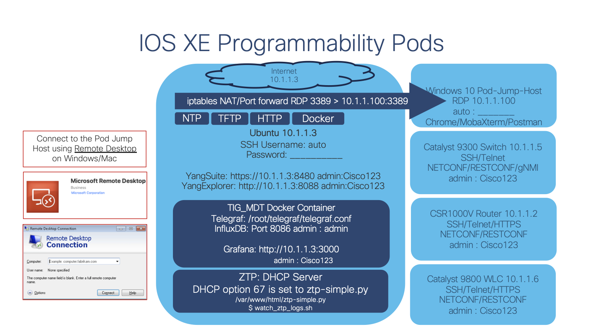
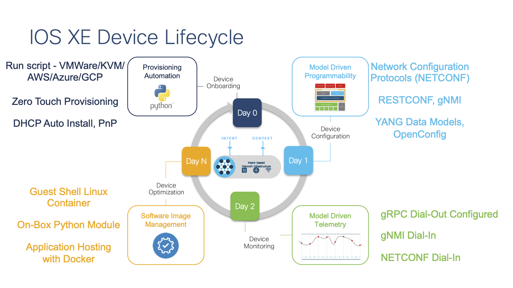

# Welcome to the Cisco IOS XE Programmablity Lab

### Lab Topology
To access the lab, you will need to use a Remote Desktop connection to the specific jump host.  The jump host is used to allow remotes access into all lab devices within the given pod envrionment.

Please refer to the IOS XE Programambility Lab Acess Sheet for specific pod access instructions and details

The services, features, and technologies that are enabled with the lab envrionment are shown below:

The modules below enable IOS XE Device Lifecycle Management:

## Modules

# Module 2 - Introduction to Python
#### [https://github.com/jeremycohoe/cisco-ios-xe-programmability-lab-module-2-python](https://github.com/jeremycohoe/cisco-ios-xe-programmability-lab-module-2-python)

This introduction to Python provides a high level overview of basics of the Python programming language. Concepts like variables, math, loops, and virtual envrionments and covered. Python can be used for Network Automation use cases so it is important to understand some of these concepts for later modules. 

# Module 3 - NETCONF + YANG
#### [https://github.com/jeremycohoe/cisco-ios-xe-programmability-lab-module-3-neconf-yang](https://github.com/jeremycohoe/cisco-ios-xe-programmability-lab-module-3-neconf-yang)

The NETCONF + YANG module is an introduction to the NETCONF API as well as the YANG data models that are available within IOS XE. YANGSuite is the GUI tool used to work with the NETCONF API as well as load the YANG data models for visual representation and to get a better understanding of the module metadata items. With YANGSuite the XML RPC payload is generated and then sent to IOS XE, and the reply payload with the requested operational or config data is displayed.

# Module 4 - RESTCONF with Postman
[https://github.com/jeremycohoe/cisco-ios-xe-programmability-lab-module-4-restconf](https://github.com/jeremycohoe/cisco-ios-xe-programmability-lab-module-4-restconf)

Get content then add description !

# Module 5 - gRPC Network Management Interface (gNMI)
#### [https://github.com/jeremycohoe/cisco-ios-xe-programmability-lab-module-5-gnmi](https://github.com/jeremycohoe/cisco-ios-xe-programmability-lab-module-5-gnmi)

This lab module covers the gRPC Network Management Interface (gNMI) that enables device programmability. gNMI supports Model Driven Telemetry which is covered in the MDT module. An overview of the API interface is provided before reviewing the configuration and implmetation details, specifically the TLS certification generation and installation into IOS XE. The gNMI API is used in both secure and insecure server modes which provides the most flexibility in the lab envrionment. The YANGSuite and gnmi_cli tooling is available to easily interact with the API and some examples for retreiving operational and configuration data is provided.

# Module 6 - Model Driven Telemetry (MDT)
#### [https://github.com/jeremycohoe/cisco-ios-xe-programmability-lab-module-6-mdt](https://github.com/jeremycohoe/cisco-ios-xe-programmability-lab-module-6-mdt)

The Model Driven Telemetry module contains an overview of the various telemetry interfaces available on IOS XE as well as the YANG data models that are available. CLI tooling and examples for **NETCONF, gRPC, and gNMI** is provided which enables base functionality and validation of the model driven telemetry interfaces. Once the basics of the interfaces are understood then the **Telegraf, InfluxDB, and Grafana tooling** is used for visual representation of the telemetry data. This solution is packaged into a Docker container where the configurations, dashboards, and sample data is avilable for viewing.

# Module 7 - Zero Touch Provisioning (ZTP)

[https://github.com/jeremycohoe/cisco-ios-xe-programmability-lab-module-7-zero-touch-provisioning](https://github.com/jeremycohoe/cisco-ios-xe-programmability-lab-module-7-zero-touch-provisioning)

In this module, you will verify and confirm the prerequisitesfor ZTP, the Zero Touch Provisioning feature of IOS XE on the Catalyst 9300 switch. At the end of this module, you will issue the ‘write erase’ command, reload the switch, and watch as the ZTP process completes and the switch is configured programmatically and automatically.

# Module 8 - Ansible CLI and NETCONF Automation

#### [https://github.com/jeremycohoe/cisco-ios-xe-programmability-lab-module-8-ansible](https://github.com/jeremycohoe/cisco-ios-xe-programmability-lab-module-8-ansible)

In this lab module the Ansible automation tooling is used for a variety of tasks. The Ansible CLI module is used to configure VRFs against multiple IOS XE devices at once. The **ios_config**  module is also used to configure some devices features including NTP and ACL's. The **NETCONF** module can be used to further programmatically configure device features using **YANG** data models, so an exmple to enable the **gRPC Model Driven Telemetry** feature is provided. Finally an example playbook is provided to **upgrade the IOS XE switch** to a new version.

# Module 9 - Guest Shell and On-Box Python
#### [https://github.com/jeremycohoe/cisco-ios-xe-programmability-lab-module-9-guestshell-onbox-python](https://github.com/jeremycohoe/cisco-ios-xe-programmability-lab-module-9-guestshell-onbox-python)

Guest Shell is the Linux container that is available within IOS XE. It provides a Python API that enables programmatic device configuration using the included on-box CLI modules. Guest Shell includes the Bash Shell with access to the YUM package manager as well as the Python interpretor which makes it a very flexible and powerful automation option for network engineers.

# Module 10 - Application Hosting with iPerf
#### [https://github.com/jeremycohoe/cisco-ios-xe-programmability-lab-module-10-application-hosting](https://github.com/jeremycohoe/cisco-ios-xe-programmability-lab-module-10-application-hosting)

The Application Hosting framework enables Docker based containers to run on top of IOS XE to enable additional edge compute use cases. iPerf is an application that enables calculation of link speeds between network and end-user devices and can be run within Docker. The networking configuration as well as the Docker workflows, and IOS XE configuration to run the Docker app are provided so that a container can easily be downloaded from DockerHub and installed and running on the IOS XE device.

