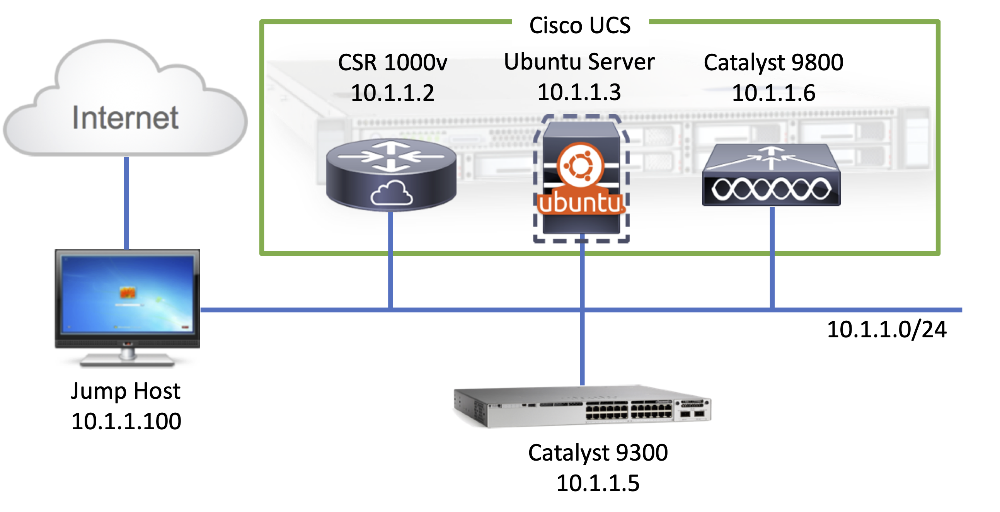
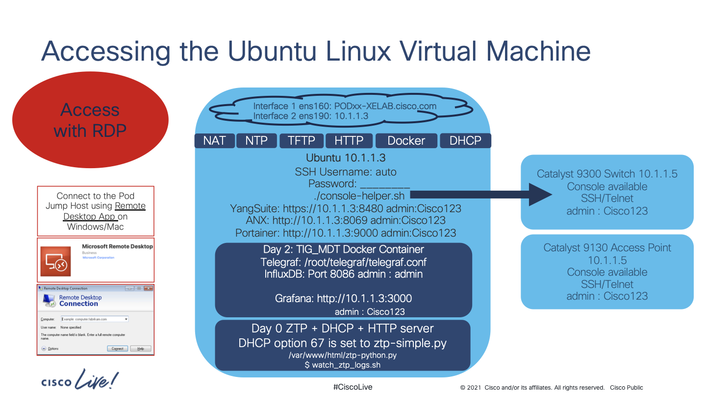

# Welcome to the Cisco IOS XE Programmablity Lab

### Version: 17.4 Cisco Live 2021
Looking for the previous version of the lab?

[https://github.com/jeremycohoe/cisco-ios-xe-programmability-lab/blob/master/README-17.2.md](https://github.com/jeremycohoe/cisco-ios-xe-programmability-lab/blob/master/README-17.2.md)

### Lab Topology
To access the lab, you will need to use a Remote Desktop connection to the specific jump host.  The jump host is used to allow remotes access into all lab devices within the given pod envrionment.

Please refer to the IOS XE Programambility Lab Acess Sheet for specific pod access instructions and details

The services, features, and technologies that are enabled with the lab envrionment are shown below:

The modules below enable IOS XE Device Lifecycle Management:

## Model Driven Telemetry

# YANG Suite

###Intro to YS
###Explore YANG
###NETCONF MDT
###gRPC receive

[https://github.com/jeremycohoe/cisco-ios-xe-programmability-lab-YANGSuite](https://github.com/jeremycohoe/cisco-ios-xe-programmability-lab-YANGSuite)

# gNOI

Load TLS certificates for secure telemetry

[https://github.com/jeremycohoe/cisco-ios-xe-programmability-lab-module-5-gnmi](https://github.com/jeremycohoe/cisco-ios-xe-programmability-lab-module-5-gnmi)

# gRPC + TLS with Telegraf and Grafana

Collect secure telemetry and visualize within Grafana

[https://github.com/jeremycohoe/cisco-ios-xe-programmability-lab-module-6-mdt](https://github.com/jeremycohoe/cisco-ios-xe-programmability-lab-module-6-mdt)

